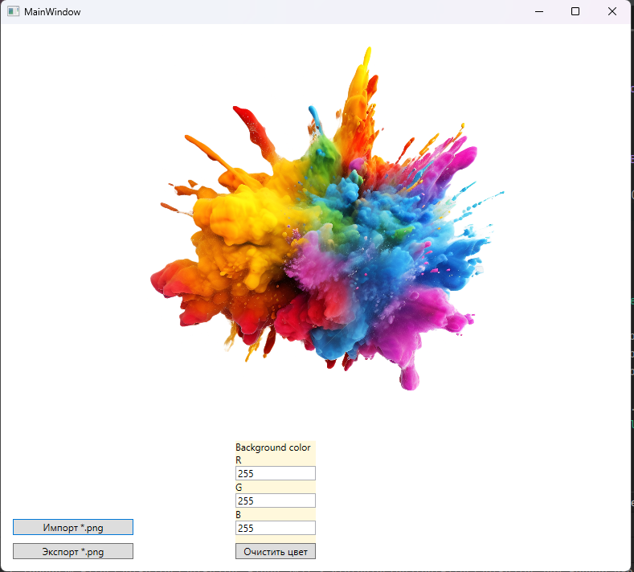

# KeyerTest
## Using

1. Нажать кнопку "Импорт *.png"
2. Открыть файл для обработки
3. Выбрать цвет фона
   
4. Нажать кнопку "Очистить цвет"
5. Нажать кнопку "Экспорт *.png"
6. Выбрать место и имя файла
7. Сохранить файл
